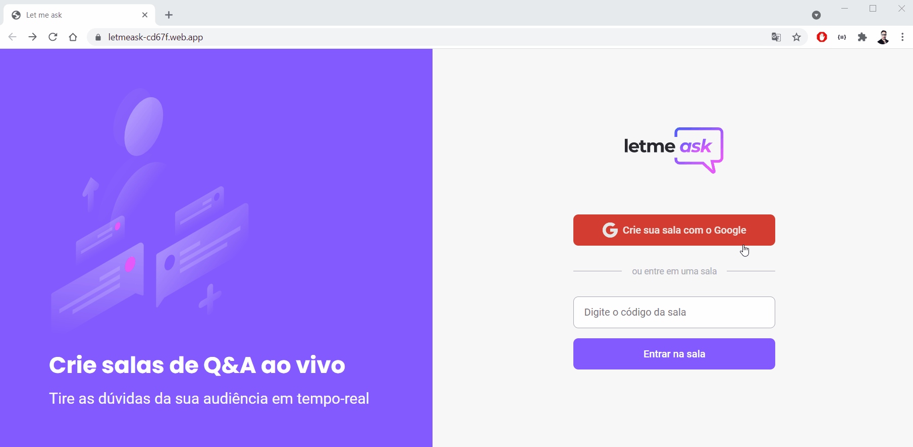
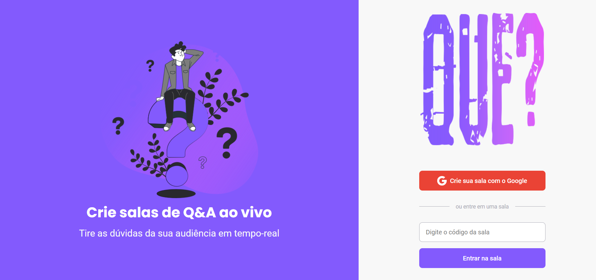

<h1 align="center">Next Level Week Together</h1>

<p align="center">

</p>

<div align="center">


</div>

<p align="center">

Home Alternativa


</p>

------------

<h2>💬 About</h2>

Let me ask is a realtime web app to create rooms for FAQ.

------------

<h2>👀 Live Preview</h2>

<a href="https://letmeask-cd67f.web.app/">Let me ask</a>

------------
<h2>🎨 Layout</h2>
<div align="justify">

💻 Check the Web layout on <a href="https://www.figma.com/file/dayLLWnU13RTyCMbvpw058/Letmeask?node-id=0%3A1">Figma</a>.


------------

<h2>🔧 Tools and Technologies</h2>

This project was developed with:

- [React](https://reactjs.org/ "React")
  
- [Typescript](https://www.typescriptlang.org/ "Typescript")

- [Firebase](https://www.firebase.google.com/ "Firebase")

------------
<h2>⏫ Next Level</h2>

✅ Responsiveness

⬜ Dark Theme

⬜ PWA

⬜ Other DB

⬜ To-do

------------
<h2>📦 How to Contribute</h2>

```
- Fork this repository;

- Make a branch with your feature: `git checkout -b my-feature`

- Commit your changes: `git commit -m 'feat: My new feature'`

- Push your branch: `git push origin my-feature`
```
------------

<h2>💡 Developed by</h2>
Letmeask was developed by <a href="https://github.com/diego3g">Diego Fernandes</a> from <a href="https://rocketseat.com.br/">Rocketseat</a> in the Next Level Week Together.

------------


<h2>📝License</h2>

This project is under MIT License. Access <a href="https://github.com/Nandosbx/podcastr-next/blob/master/LICENSE.md">License</a> and learn more.

------------


<footer align="center">
 <strong align="center">Made with 💜 by Fernando Batista</strong>
</footer>
